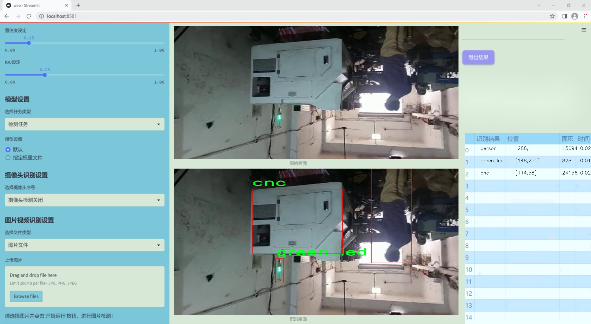
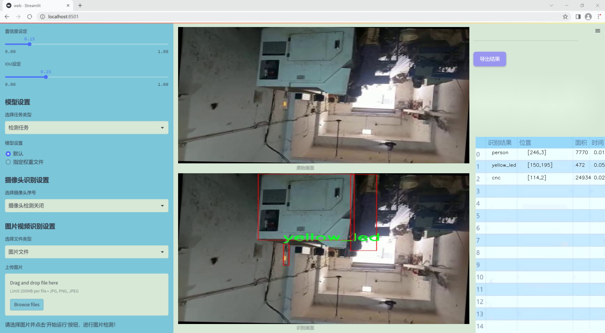
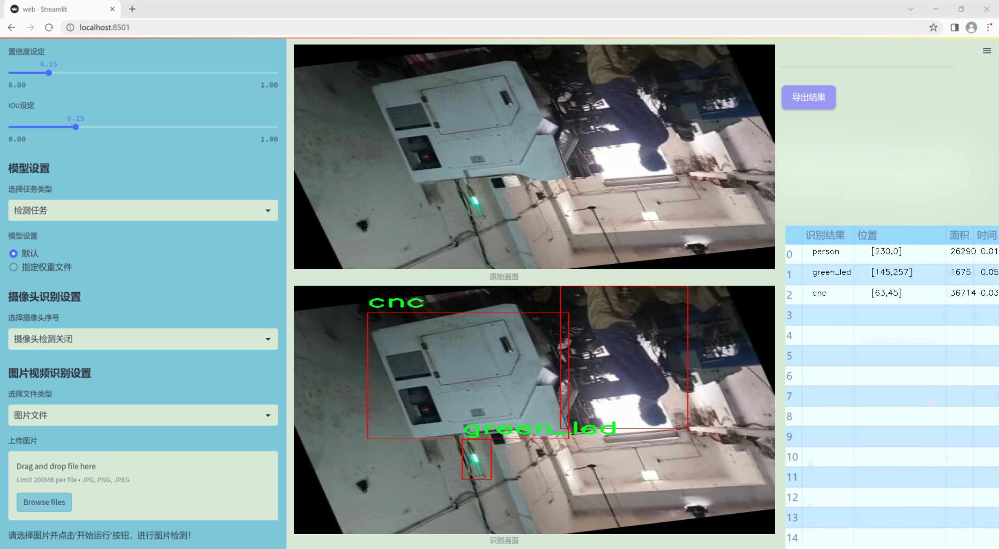
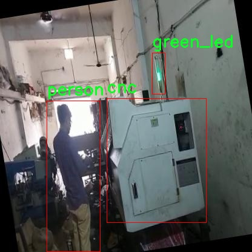
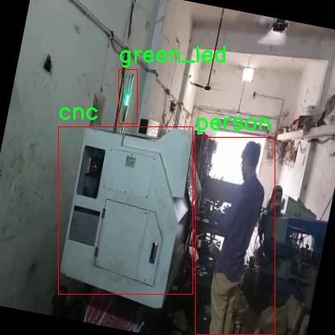
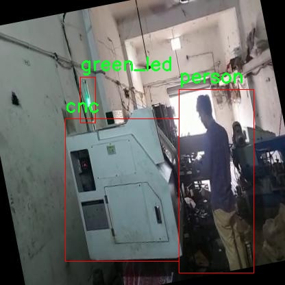
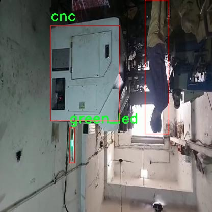
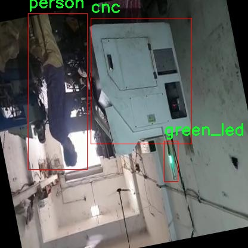

# 改进yolo11-GDFPN等200+全套创新点大全：工厂工人设备安全操作监测系统源码＆数据集全套

### 1.图片效果展示







##### 项目来源 **[人工智能促进会 2024.10.24](https://kdocs.cn/l/cszuIiCKVNis)**

注意：由于项目一直在更新迭代，上面“1.图片效果展示”和“2.视频效果展示”展示的系统图片或者视频可能为老版本，新版本在老版本的基础上升级如下：（实际效果以升级的新版本为准）

  （1）适配了YOLOV11的“目标检测”模型和“实例分割”模型，通过加载相应的权重（.pt）文件即可自适应加载模型。

  （2）支持“图片识别”、“视频识别”、“摄像头实时识别”三种识别模式。

  （3）支持“图片识别”、“视频识别”、“摄像头实时识别”三种识别结果保存导出，解决手动导出（容易卡顿出现爆内存）存在的问题，识别完自动保存结果并导出到tempDir中。

  （4）支持Web前端系统中的标题、背景图等自定义修改。

  另外本项目提供训练的数据集和训练教程,暂不提供权重文件（best.pt）,需要您按照教程进行训练后实现图片演示和Web前端界面演示的效果。

### 2.视频效果展示

[2.1 视频效果展示](https://www.bilibili.com/video/BV1gCy2YKE3D/)

### 3.背景

研究背景与意义

随着工业自动化的快速发展，工厂的生产效率和安全性面临着前所未有的挑战。尤其是在高风险的工作环境中，工人操作设备的安全性直接关系到人身安全和生产稳定性。因此，建立一个高效的监测系统以实时监控工人的设备操作行为，确保其符合安全标准，显得尤为重要。基于此背景，本文提出了一种改进的YOLOv11模型，用于工厂工人设备安全操作的监测系统。

本研究的核心在于利用深度学习技术，特别是目标检测算法，来实现对工厂环境中工人及设备的实时监控。通过对cnc11数据集的分析，该数据集包含1000张图像，涵盖了关键的操作对象，如CNC机床、绿色指示灯、工人及黄色指示灯等。通过对这些类别的精准识别与分类，系统能够有效判断工人在操作设备时是否遵循安全规范。例如，绿色指示灯的亮起通常表示设备处于安全状态，而黄色指示灯则可能暗示潜在的风险。通过实时监测这些信号，系统能够及时发出警报，防止安全事故的发生。

此外，改进YOLOv11模型的引入，不仅提高了目标检测的准确性和实时性，还增强了系统在复杂工厂环境中的适应能力。通过不断优化算法，提升模型对不同光照、角度及遮挡情况的鲁棒性，确保在各种工作条件下都能保持高效的监测能力。这一系统的实施，不仅能够降低工厂事故发生的概率，还能提升工人的安全意识，推动安全文化的建设，具有重要的理论和实践意义。

### 4.数据集信息展示

##### 4.1 本项目数据集详细数据（类别数＆类别名）

nc: 4
names: ['cnc', 'green_led', 'person', 'yellow_led']


该项目为【目标检测】数据集，请在【训练教程和Web端加载模型教程（第三步）】这一步的时候按照【目标检测】部分的教程来训练

##### 4.2 本项目数据集信息介绍

本项目数据集信息介绍

本项目所使用的数据集名为“cnc11”，旨在为改进YOLOv11的工厂工人设备安全操作监测系统提供强有力的支持。该数据集专注于工厂环境中的关键元素，涵盖了四个主要类别，分别是“cnc”（计算机数控机床）、“green_led”（绿色指示灯）、“person”（工人）和“yellow_led”（黄色指示灯）。这些类别的选择反映了工厂操作中安全监测的核心要素，能够有效地帮助系统识别和分析工人和设备之间的互动。

在数据集的构建过程中，研究团队精心收集了大量的图像数据，确保涵盖了不同工厂环境下的多样性。这些图像不仅包括了工人在操作数控机床的场景，还涵盖了指示灯的状态，尤其是绿色和黄色指示灯的不同情境。绿色指示灯通常表示设备处于安全状态，而黄色指示灯则可能暗示潜在的警告或需要注意的情况。因此，准确识别这些指示灯的状态对于确保工人安全至关重要。

此外，数据集中包含了各种工人活动的场景，确保模型能够在不同的工作条件下进行有效的监测。这些场景包括工人在进行正常操作、检查设备、以及在潜在危险情况下的反应等。通过丰富的数据样本，模型将能够学习到工人和设备之间的复杂关系，从而提高监测系统的准确性和可靠性。

总之，“cnc11”数据集为本项目提供了一个全面的基础，使得改进后的YOLOv11能够在工厂环境中更好地识别和监测工人及设备的安全操作，进而提升整体的安全管理水平。通过这一数据集的训练，期望能够实现更高效的实时监测，降低工伤事故的发生率，确保工人的安全与健康。











### 5.全套项目环境部署视频教程（零基础手把手教学）

[5.1 所需软件PyCharm和Anaconda安装教程（第一步）](https://www.bilibili.com/video/BV1BoC1YCEKi/?spm_id_from=333.999.0.0&vd_source=bc9aec86d164b67a7004b996143742dc)


[5.2 安装Python虚拟环境创建和依赖库安装视频教程（第二步）](https://www.bilibili.com/video/BV1ZoC1YCEBw?spm_id_from=333.788.videopod.sections&vd_source=bc9aec86d164b67a7004b996143742dc)

### 6.改进YOLOv11训练教程和Web_UI前端加载模型教程（零基础手把手教学）

[6.1 改进YOLOv11训练教程和Web_UI前端加载模型教程（第三步）](https://www.bilibili.com/video/BV1BoC1YCEhR?spm_id_from=333.788.videopod.sections&vd_source=bc9aec86d164b67a7004b996143742dc)


按照上面的训练视频教程链接加载项目提供的数据集，运行train.py即可开始训练



     Epoch   gpu_mem       box       obj       cls    labels  img_size
     1/200     20.8G   0.01576   0.01955  0.007536        22      1280: 100%|██████████| 849/849 [14:42<00:00,  1.04s/it]
               Class     Images     Labels          P          R     mAP@.5 mAP@.5:.95: 100%|██████████| 213/213 [01:14<00:00,  2.87it/s]
                 all       3395      17314      0.994      0.957      0.0957      0.0843

     Epoch   gpu_mem       box       obj       cls    labels  img_size
     2/200     20.8G   0.01578   0.01923  0.007006        22      1280: 100%|██████████| 849/849 [14:44<00:00,  1.04s/it]
               Class     Images     Labels          P          R     mAP@.5 mAP@.5:.95: 100%|██████████| 213/213 [01:12<00:00,  2.95it/s]
                 all       3395      17314      0.996      0.956      0.0957      0.0845

     Epoch   gpu_mem       box       obj       cls    labels  img_size
     3/200     20.8G   0.01561    0.0191  0.006895        27      1280: 100%|██████████| 849/849 [10:56<00:00,  1.29it/s]
               Class     Images     Labels          P          R     mAP@.5 mAP@.5:.95: 100%|███████   | 187/213 [00:52<00:00,  4.04it/s]
                 all       3395      17314      0.996      0.957      0.0957      0.0845


###### [项目数据集下载链接](https://kdocs.cn/l/cszuIiCKVNis)

### 7.原始YOLOv11算法讲解

YOLO11采用改进的骨干和颈部架构，增强了特征提取能力，提高了物体检测的精确度和复杂任务的表现。YOLO11引入精炼的架构设计和优化的训练流程，实现更快的处理速度，同时保持精度和性能之间的最佳平衡。通过模型设计的进步，YOLO11m在COCO数据集上实现了更高的均值平均精度（mAP），同时使用比YOLOv8m少22%的参数，使其在不妥协准确性的情况下更加计算高效。YOLO11可以无缝部署在各种环境中，包括边缘设备、云平台以及支持NVIDIA
GPU的系统，确保最大灵活性。无论是物体检测、实例分割、图像分类、姿态估计，还是定向物体检测（OBB），YOLO11都旨在应对多样的计算机视觉挑战。


##### **Ultralytics YOLO11相比于之前版本的主要改进有哪些？**

Ultralytics YOLO11在其前身基础上引入了几项重要进步。主要改进包括：

  1. **增强的特征提取** ：YOLO11采用改进的骨干和颈部架构，增强了特征提取能力，提高了物体检测的精确度。
  2.  **优化的效率和速度** ：精炼的架构设计和优化的训练流程实现了更快的处理速度，同时保持了准确性和性能之间的平衡。
  3.  **更高的准确性与更少的参数** ：YOLO11m在COCO数据集上实现了更高的均值平均精度（mAP），同时使用比YOLOv8m少22%的参数，使其在不妥协准确性的情况下更加计算高效。
  4.  **环境适应性强** ：YOLO11可以在多种环境中部署，包括边缘设备、云平台以及支持NVIDIA GPU的系统。
  5.  **支持广泛的任务** ：YOLO11支持多种计算机视觉任务，如物体检测、实例分割、图像分类、姿态估计和定向物体检测（OBB）。

我们先来看一下其网络结构有什么变化，可以看出，相比较于YOLOv8模型，其将CF2模块改成C3K2，同时在SPPF模块后面添加了一个C2PSA模块，且将YOLOv10的head思想引入到YOLO11的head中，使用深度可分离的方法，减少冗余计算，提高效率。下面我们来详细看一下这两个模块的结构是怎么构成的，以及它们为什么要这样设计


##### C3K2的网络结构

从下面图中我们可以看到，C3K2模块其实就是C2F模块转变出来的，它代码中有一个设置，就是当c3k这个参数为FALSE的时候，C3K2模块就是C2F模块，也就是说它的Bottleneck是普通的Bottleneck；反之当它为true的时候，将Bottleneck模块替换成C3模块。


##### C2PSA的网络结构

` `C2PSA是对 `C2f` 模块的扩展，它结合了PSA(Pointwise Spatial
Attention)块，用于增强特征提取和注意力机制。通过在标准 `C2f` 模块中引入 PSA
块，C2PSA实现了更强大的注意力机制，从而提高了模型对重要特征的捕捉能力。


##### **C2f 模块回顾：**

**** C2f模块是一个更快的 CSP（Cross Stage Partial）瓶颈实现，它通过两个卷积层和多个 Bottleneck
块进行特征提取。相比传统的 CSPNet，C2f 优化了瓶颈层的结构，使得计算速度更快。在 C2f中，`cv1` 是第一个 1x1
卷积，用于减少通道数；`cv2` 是另一个 1x1 卷积，用于恢复输出通道数。而 `n` 是一个包含 Bottleneck 块的数量，用于提取特征。

##### **C2PSA 模块的增强** ：

**C2PSA** 扩展了 C2f，通过引入PSA( **Position-Sensitive Attention)**
，旨在通过多头注意力机制和前馈神经网络来增强特征提取能力。它可以选择性地添加残差结构（shortcut）以优化梯度传播和网络训练效果。同时，使用FFN
可以将输入特征映射到更高维的空间，捕获输入特征的复杂非线性关系，允许模型学习更丰富的特征表示。

##### head部分

YOLO11在head部分的cls分支上使用深度可分离卷积 ，具体代码如下，cv2边界框回归分支，cv3分类分支。

    
    
     self.cv2 = nn.ModuleList(
                nn.Sequential(Conv(x, c2, 3), Conv(c2, c2, 3), nn.Conv2d(c2, 4 * self.reg_max, 1)) for x in ch
            )
            self.cv3 = nn.ModuleList(
                nn.Sequential(
                    nn.Sequential(DWConv(x, x, 3), Conv(x, c3, 1)),
                    nn.Sequential(DWConv(c3, c3, 3), Conv(c3, c3, 1)),
                    nn.Conv2d(c3, self.nc, 1),
                )
                for x in ch
            )


### 8.200+种全套改进YOLOV11创新点原理讲解

#### 8.1 200+种全套改进YOLOV11创新点原理讲解大全

由于篇幅限制，每个创新点的具体原理讲解就不全部展开，具体见下列网址中的改进模块对应项目的技术原理博客网址【Blog】（创新点均为模块化搭建，原理适配YOLOv5~YOLOv11等各种版本）

[改进模块技术原理博客【Blog】网址链接](https://gitee.com/qunmasj/good)


#### 8.2 精选部分改进YOLOV11创新点原理讲解

###### 这里节选部分改进创新点展开原理讲解(完整的改进原理见上图和[改进模块技术原理博客链接](https://gitee.com/qunmasj/good)【如果此小节的图加载失败可以通过CSDN或者Github搜索该博客的标题访问原始博客，原始博客图片显示正常】


### LSKNet的架构
该博客提出的结构层级依次为：

LSK module（大核卷积序列+空间选择机制） < LSK Block （LK Selection + FFN）<LSKNet（N个LSK Block）


#### LSK 模块

LSK Block
LSKNet 是主干网络中的一个可重复堆叠的块（Block），每个LSK Block包括两个残差子块，即大核选择子块（Large Kernel Selection，LK Selection）和前馈网络子块（Feed-forward Network ，FFN），如图8。LK Selection子块根据需要动态地调整网络的感受野，FFN子块用于通道混合和特征细化，由一个全连接层、一个深度卷积、一个 GELU 激活和第二个全连接层组成。

LSK module（LSK 模块，图4）由一个大核卷积序列（large kernel convolutions）和一个空间核选择机制（spatial kernel selection mechanism）组成，被嵌入到了LSK Block 的 LK Selection子块中。

#### Large Kernel Convolutions
因为不同类型的目标对背景信息的需求不同，这就需要模型能够自适应选择不同大小的背景范围。因此，作者通过解耦出一系列具有大卷积核、且不断扩张的Depth-wise 卷积，构建了一个更大感受野的网络。

具体地，假设序列中第i个Depth-wise 卷积核的大小为 ，扩张率为 d，感受野为 ，它们满足以下关系：


卷积核大小和扩张率的增加保证了感受野能够快速增大。此外，我们设置了扩张率的上限，以保证扩张卷积不会引入特征图之间的差距。


Table2的卷积核大小可根据公式（1）和（2）计算，详见下图：


这样设计的好处有两点。首先，能够产生具有多种不同大小感受野的特征，便于后续的核选择；第二，序列解耦比简单的使用一个大型卷积核效果更好。如上图表2所示，解耦操作相对于标准的大型卷积核，有效地将低了模型的参数量。

为了从输入数据  的不同区域获取丰富的背景信息特征，可采用一系列解耦的、不用感受野的Depth-wise 卷积核：


其中，是卷积核为 、扩张率为  的Depth-wise 卷积操作。假设有个解耦的卷积核，每个卷积操作后又要经过一个的卷积层进行空间特征向量的通道融合。


之后，针对不同的目标，可基于获取的多尺度特征，通过下文中的选择机制动态选择合适的卷积核大小。

这一段的意思可以简单理解为：

把一个大的卷积核拆成了几个小的卷积核，比如一个大小为5，扩张率为1的卷积核加上一个大小为7，扩张率为3的卷积核，感受野为23，与一个大小为23，扩张率为1的卷积核的感受野是一样的。因此可用两个小的卷积核替代一个大的卷积核，同理一个大小为29的卷积核也可以用三个小的卷积代替（Table 2），这样可以有效的减少参数，且更灵活。

将输入数据依次通过这些小的卷积核（公式3），并在每个小的卷积核后面接上一个1×1的卷积进行通道融合（公式4）。

#### Spatial Kernel Selection
为了使模型更关注目标在空间上的重点背景信息，作者使用空间选择机制从不同尺度的大卷积核中对特征图进行空间选择。

首先，将来自于不同感受野卷积核的特征进行concate拼接，然后，应用通道级的平均池化和最大池化提取空间关系，其中， 和  是平均池化和最大池化后的空间特征描述符。为了实现不同空间描述符的信息交互，作者利用卷积层将空间池化特征进行拼接，将2个通道的池化特征转换为N个空间注意力特征图，之后，将Sigmoid激活函数应用到每一个空间注意力特征图，可获得每个解耦的大卷积核所对应的独立的空间选择掩膜，又然后，将解耦后的大卷积核序列的特征与对应的空间选择掩膜进行加权处理，并通过卷积层进行融合获得注意力特征 ，最后LSK module的输出可通过输入特征  与注意力特征  的逐元素点成获得，公式对应于结构图上的操作如下：


### 9.系统功能展示

图9.1.系统支持检测结果表格显示

  图9.2.系统支持置信度和IOU阈值手动调节

  图9.3.系统支持自定义加载权重文件best.pt(需要你通过步骤5中训练获得)

  图9.4.系统支持摄像头实时识别

  图9.5.系统支持图片识别

  图9.6.系统支持视频识别

  图9.7.系统支持识别结果文件自动保存

  图9.8.系统支持Excel导出检测结果数据


### 10. YOLOv11核心改进源码讲解

#### 10.1 efficientViT.py

以下是对给定代码的核心部分进行提炼和详细注释的结果：

```python
import torch
import torch.nn as nn
import torch.nn.functional as F
import itertools
from timm.models.layers import SqueezeExcite

# 定义高效ViT模型的基本构建块
class Conv2d_BN(nn.Sequential):
    """带有BatchNorm的卷积层"""
    def __init__(self, in_channels, out_channels, kernel_size=1, stride=1, padding=0, dilation=1, groups=1, bn_weight_init=1):
        super().__init__()
        # 添加卷积层
        self.add_module('conv', nn.Conv2d(in_channels, out_channels, kernel_size, stride, padding, dilation, groups, bias=False))
        # 添加BatchNorm层
        self.add_module('bn', nn.BatchNorm2d(out_channels))
        # 初始化BatchNorm的权重
        nn.init.constant_(self.bn.weight, bn_weight_init)
        nn.init.constant_(self.bn.bias, 0)

    @torch.no_grad()
    def switch_to_deploy(self):
        """将训练模式转换为推理模式，合并卷积和BatchNorm层"""
        conv, bn = self._modules.values()
        # 计算合并后的卷积权重和偏置
        w = bn.weight / (bn.running_var + bn.eps)**0.5
        w = conv.weight * w[:, None, None, None]
        b = bn.bias - bn.running_mean * bn.weight / (bn.running_var + bn.eps)**0.5
        # 创建新的卷积层
        new_conv = nn.Conv2d(w.size(1) * conv.groups, w.size(0), w.shape[2:], stride=conv.stride, padding=conv.padding, dilation=conv.dilation, groups=conv.groups)
        new_conv.weight.data.copy_(w)
        new_conv.bias.data.copy_(b)
        return new_conv

class PatchMerging(nn.Module):
    """用于合并图像块的模块"""
    def __init__(self, dim, out_dim):
        super().__init__()
        hid_dim = int(dim * 4)  # 隐藏维度
        self.conv1 = Conv2d_BN(dim, hid_dim, kernel_size=1)
        self.act = nn.ReLU()
        self.conv2 = Conv2d_BN(hid_dim, hid_dim, kernel_size=3, stride=2, padding=1, groups=hid_dim)
        self.se = SqueezeExcite(hid_dim, .25)  # Squeeze-and-Excitation模块
        self.conv3 = Conv2d_BN(hid_dim, out_dim, kernel_size=1)

    def forward(self, x):
        """前向传播"""
        x = self.conv3(self.se(self.act(self.conv2(self.act(self.conv1(x))))))
        return x

class FFN(nn.Module):
    """前馈神经网络模块"""
    def __init__(self, ed, h):
        super().__init__()
        self.pw1 = Conv2d_BN(ed, h)  # 逐点卷积
        self.act = nn.ReLU()
        self.pw2 = Conv2d_BN(h, ed, bn_weight_init=0)  # 逐点卷积

    def forward(self, x):
        """前向传播"""
        x = self.pw2(self.act(self.pw1(x)))
        return x

class LocalWindowAttention(nn.Module):
    """局部窗口注意力机制"""
    def __init__(self, dim, key_dim, num_heads=8, window_resolution=7):
        super().__init__()
        self.attn = CascadedGroupAttention(dim, key_dim, num_heads, resolution=window_resolution)

    def forward(self, x):
        """前向传播"""
        B, C, H, W = x.shape
        if H <= self.window_resolution and W <= self.window_resolution:
            x = self.attn(x)
        else:
            # 处理大于窗口分辨率的输入
            x = x.permute(0, 2, 3, 1)  # 转换维度
            # 填充输入以适应窗口分辨率
            pad_b = (self.window_resolution - H % self.window_resolution) % self.window_resolution
            pad_r = (self.window_resolution - W % self.window_resolution) % self.window_resolution
            if pad_b > 0 or pad_r > 0:
                x = F.pad(x, (0, 0, 0, pad_r, 0, pad_b))
            # 窗口分区和反向处理
            # ... (省略详细的窗口处理代码)
        return x

class EfficientViTBlock(nn.Module):
    """高效ViT基本构建块"""
    def __init__(self, ed, kd, nh=8):
        super().__init__()
        self.dw0 = Residual(Conv2d_BN(ed, ed, kernel_size=3, groups=ed))
        self.ffn0 = Residual(FFN(ed, int(ed * 2)))
        self.mixer = Residual(LocalWindowAttention(ed, kd, nh))
        self.dw1 = Residual(Conv2d_BN(ed, ed, kernel_size=3, groups=ed))
        self.ffn1 = Residual(FFN(ed, int(ed * 2)))

    def forward(self, x):
        """前向传播"""
        return self.ffn1(self.dw1(self.mixer(self.ffn0(self.dw0(x)))))

class EfficientViT(nn.Module):
    """高效ViT模型"""
    def __init__(self, img_size=400, patch_size=16, embed_dim=[64, 128, 192], depth=[1, 2, 3], num_heads=[4, 4, 4]):
        super().__init__()
        self.patch_embed = nn.Sequential(
            Conv2d_BN(3, embed_dim[0] // 8, kernel_size=3, stride=2, padding=1),
            nn.ReLU(),
            # 逐层添加卷积层
        )
        # 构建多个EfficientViTBlock
        self.blocks = nn.ModuleList()
        for ed, kd, dpth, nh in zip(embed_dim, num_heads, depth):
            for _ in range(dpth):
                self.blocks.append(EfficientViTBlock(ed, kd, nh))

    def forward(self, x):
        """前向传播"""
        x = self.patch_embed(x)
        for block in self.blocks:
            x = block(x)
        return x

# 创建高效ViT模型实例
if __name__ == '__main__':
    model = EfficientViT(img_size=224)
    inputs = torch.randn((1, 3, 640, 640))
    res = model(inputs)
    for i in res:
        print(i.size())
```

### 代码说明：
1. **Conv2d_BN**: 这个类定义了一个带有Batch Normalization的卷积层，并提供了一个方法用于将其转换为推理模式。
2. **PatchMerging**: 该模块用于将图像块合并，通常用于降低特征图的分辨率。
3. **FFN**: 定义了一个前馈神经网络模块，包含两个逐点卷积层和一个ReLU激活函数。
4. **LocalWindowAttention**: 实现了局部窗口注意力机制，适用于处理较大输入的情况。
5. **EfficientViTBlock**: 定义了高效ViT的基本构建块，包含卷积层、前馈网络和注意力机制。
6. **EfficientViT**: 整个模型的定义，包含图像嵌入和多个高效ViT块的堆叠。

以上代码保留了模型的核心结构和功能，注释详细解释了每个部分的作用。

这个文件定义了一个名为 `EfficientViT` 的深度学习模型架构，主要用于视觉任务。该模型是基于视觉变换器（Vision Transformer, ViT）的高效版本，具有多个变体（M0 到 M5），每个变体具有不同的参数配置。

文件的开头部分引入了必要的库，包括 PyTorch 和一些特定的模块。接着定义了一些基础的组件，如 `Conv2d_BN` 类，它结合了卷积层和批归一化（Batch Normalization），并提供了一个方法 `switch_to_deploy` 用于在推理时将其转换为一个普通的卷积层。

接下来，文件中定义了多个模块，包括 `PatchMerging`、`Residual`、`FFN`（前馈网络）、`CascadedGroupAttention` 和 `LocalWindowAttention`。这些模块是构建 `EfficientViTBlock` 的基础，后者是模型的核心构建块，负责特征提取和注意力机制的实现。

`EfficientViT` 类则是整个模型的实现。它首先通过 `patch_embed` 将输入图像进行分块处理，然后依次通过多个 `EfficientViTBlock` 进行特征提取。每个块可以根据设定的参数进行不同的操作，如下采样和特征融合。模型的输出是一个包含多个阶段特征的列表。

在文件的最后部分，定义了多个模型配置（如 `EfficientViT_m0` 到 `EfficientViT_m5`），每个配置包含不同的图像大小、嵌入维度、深度等参数。这些配置可以通过相应的函数（如 `EfficientViT_M0`）进行实例化，并支持加载预训练权重和替换批归一化层。

最后，在 `__main__` 部分，实例化了 `EfficientViT_M0` 模型，并对随机生成的输入进行了前向传播，输出了每个阶段的特征图的尺寸。这段代码展示了如何使用这个模型进行推理。

总体而言，这个文件实现了一个灵活且高效的视觉变换器架构，适用于各种视觉任务，并提供了多种配置以满足不同的需求。

#### 10.2 VanillaNet.py

以下是简化后的核心代码，并附上详细的中文注释：

```python
import torch
import torch.nn as nn
import torch.nn.functional as F
from timm.layers import weight_init

# 定义激活函数类，继承自ReLU
class Activation(nn.ReLU):
    def __init__(self, dim, act_num=3, deploy=False):
        super(Activation, self).__init__()
        self.deploy = deploy  # 是否处于部署模式
        # 权重参数初始化
        self.weight = torch.nn.Parameter(torch.randn(dim, 1, act_num * 2 + 1, act_num * 2 + 1))
        self.bias = None
        self.bn = nn.BatchNorm2d(dim, eps=1e-6)  # 批归一化
        self.dim = dim
        self.act_num = act_num
        weight_init.trunc_normal_(self.weight, std=.02)  # 权重初始化

    def forward(self, x):
        # 前向传播
        if self.deploy:
            return F.conv2d(
                super(Activation, self).forward(x), 
                self.weight, self.bias, padding=(self.act_num * 2 + 1) // 2, groups=self.dim)
        else:
            return self.bn(F.conv2d(
                super(Activation, self).forward(x),
                self.weight, padding=self.act_num, groups=self.dim))

    def switch_to_deploy(self):
        # 切换到部署模式，融合批归一化
        if not self.deploy:
            kernel, bias = self._fuse_bn_tensor(self.weight, self.bn)
            self.weight.data = kernel
            self.bias = torch.nn.Parameter(torch.zeros(self.dim))
            self.bias.data = bias
            self.__delattr__('bn')  # 删除bn属性
            self.deploy = True

    def _fuse_bn_tensor(self, weight, bn):
        # 融合批归一化和卷积层的权重
        kernel = weight
        running_mean = bn.running_mean
        running_var = bn.running_var
        gamma = bn.weight
        beta = bn.bias
        eps = bn.eps
        std = (running_var + eps).sqrt()
        t = (gamma / std).reshape(-1, 1, 1, 1)
        return kernel * t, beta + (0 - running_mean) * gamma / std

# 定义网络块
class Block(nn.Module):
    def __init__(self, dim, dim_out, act_num=3, stride=2, deploy=False):
        super().__init__()
        self.deploy = deploy
        if self.deploy:
            self.conv = nn.Conv2d(dim, dim_out, kernel_size=1)  # 部署模式下的卷积
        else:
            self.conv1 = nn.Sequential(
                nn.Conv2d(dim, dim, kernel_size=1),
                nn.BatchNorm2d(dim, eps=1e-6),
            )
            self.conv2 = nn.Sequential(
                nn.Conv2d(dim, dim_out, kernel_size=1),
                nn.BatchNorm2d(dim_out, eps=1e-6)
            )
        self.pool = nn.MaxPool2d(stride) if stride != 1 else nn.Identity()  # 池化层
        self.act = Activation(dim_out, act_num)  # 激活函数

    def forward(self, x):
        # 前向传播
        if self.deploy:
            x = self.conv(x)
        else:
            x = self.conv1(x)
            x = F.leaky_relu(x, negative_slope=1)  # 使用Leaky ReLU激活
            x = self.conv2(x)

        x = self.pool(x)  # 池化
        x = self.act(x)  # 激活
        return x

    def switch_to_deploy(self):
        # 切换到部署模式
        if not self.deploy:
            kernel, bias = self._fuse_bn_tensor(self.conv1[0], self.conv1[1])
            self.conv1[0].weight.data = kernel
            self.conv1[0].bias.data = bias
            kernel, bias = self._fuse_bn_tensor(self.conv2[0], self.conv2[1])
            self.conv = self.conv2[0]  # 更新卷积层
            self.conv.weight.data = kernel
            self.conv.bias.data = bias
            self.__delattr__('conv1')
            self.__delattr__('conv2')
            self.act.switch_to_deploy()  # 激活函数切换
            self.deploy = True

# 定义主网络结构
class VanillaNet(nn.Module):
    def __init__(self, in_chans=3, num_classes=1000, dims=[96, 192, 384, 768], strides=[2, 2, 2, 1], deploy=False):
        super().__init__()
        self.deploy = deploy
        if self.deploy:
            self.stem = nn.Sequential(
                nn.Conv2d(in_chans, dims[0], kernel_size=4, stride=4),
                Activation(dims[0])
            )
        else:
            self.stem1 = nn.Sequential(
                nn.Conv2d(in_chans, dims[0], kernel_size=4, stride=4),
                nn.BatchNorm2d(dims[0], eps=1e-6),
            )
            self.stem2 = nn.Sequential(
                nn.Conv2d(dims[0], dims[0], kernel_size=1, stride=1),
                nn.BatchNorm2d(dims[0], eps=1e-6),
                Activation(dims[0])
            )

        self.stages = nn.ModuleList()
        for i in range(len(strides)):
            stage = Block(dim=dims[i], dim_out=dims[i + 1], stride=strides[i], deploy=deploy)
            self.stages.append(stage)

    def forward(self, x):
        # 前向传播
        if self.deploy:
            x = self.stem(x)
        else:
            x = self.stem1(x)
            x = F.leaky_relu(x, negative_slope=1)
            x = self.stem2(x)

        for stage in self.stages:
            x = stage(x)  # 通过每个Block
        return x

    def switch_to_deploy(self):
        # 切换到部署模式
        if not self.deploy:
            self.stem2[2].switch_to_deploy()
            kernel, bias = self._fuse_bn_tensor(self.stem1[0], self.stem1[1])
            self.stem1[0].weight.data = kernel
            self.stem1[0].bias.data = bias
            self.stem = nn.Sequential(self.stem1[0], self.stem2[2])  # 更新stem
            self.__delattr__('stem1')
            self.__delattr__('stem2')

            for stage in self.stages:
                stage.switch_to_deploy()  # 更新每个Block
            self.deploy = True

# 测试代码
if __name__ == '__main__':
    inputs = torch.randn((1, 3, 640, 640))  # 随机输入
    model = VanillaNet(dims=[128*4, 256*4, 512*4, 1024*4])  # 创建模型
    pred = model(inputs)  # 前向传播
    for i in pred:
        print(i.size())  # 输出每层的尺寸
```

### 代码说明：
1. **Activation 类**：自定义的激活函数类，包含了卷积和批归一化的融合逻辑。
2. **Block 类**：网络的基本构建块，包含卷积层、池化层和激活函数。
3. **VanillaNet 类**：主网络结构，包含多个 Block 以及输入处理的逻辑。
4. **switch_to_deploy 方法**：用于将训练模式切换到部署模式，优化模型的推理速度。
5. **前向传播**：定义了如何通过网络传递输入数据并获得输出。

这个程序文件`VanillaNet.py`实现了一个名为VanillaNet的深度学习模型，主要用于图像处理任务。文件开头包含版权信息和使用条款，表明该程序是开源的，并且可以在MIT许可证下进行修改和再分发。

程序首先导入了必要的库，包括PyTorch及其神经网络模块、功能模块、以及一些自定义的层和初始化函数。接着，定义了一个名为`activation`的类，继承自`nn.ReLU`，用于实现带有可学习参数的激活函数。这个类中包含了权重和偏置的初始化、前向传播的实现以及批归一化的融合方法。

接下来，定义了一个`Block`类，它是VanillaNet的基本构建块。每个Block包含多个卷积层和激活函数，支持不同的步幅和可选的自适应池化。Block类的`forward`方法定义了数据如何通过这个块进行处理，并在需要时进行池化和激活。

`VanillaNet`类是模型的核心部分，包含了多个Block的堆叠。构造函数中根据输入通道数、类别数、各层的维度和步幅等参数初始化网络结构。模型的前向传播方法会依次通过各个Block，并在特定的尺度下提取特征。

此外，程序还定义了一些辅助函数，例如`update_weight`用于更新模型的权重，确保加载的权重与模型结构相匹配。接下来，提供了一系列函数（如`vanillanet_5`到`vanillanet_13_x1_5_ada_pool`）用于创建不同配置的VanillaNet模型，并可选择加载预训练权重。

最后，在`__main__`部分，程序创建了一个输入张量并实例化了一个VanillaNet模型，然后进行前向传播并打印输出特征的尺寸。这部分代码用于测试模型的基本功能。

整体来看，这个程序实现了一个灵活且可扩展的深度学习模型，适用于多种图像处理任务，具有可学习的激活函数和多种配置选项，方便用户根据需求进行调整和使用。

#### 10.3 CTrans.py

以下是代码中最核心的部分，并附上详细的中文注释：

```python
import torch
import torch.nn as nn
import numpy as np
from torch.nn import Dropout, Softmax, Conv2d, LayerNorm

class Channel_Embeddings(nn.Module):
    """构建从图像块和位置嵌入的通道嵌入。"""
    def __init__(self, patchsize, img_size, in_channels):
        super().__init__()
        img_size = (img_size, img_size)  # 将图像大小转换为元组
        patch_size = (patchsize, patchsize)  # 将补丁大小转换为元组
        n_patches = (img_size[0] // patch_size[0]) * (img_size[1] // patch_size[1])  # 计算补丁数量

        # 定义补丁嵌入层
        self.patch_embeddings = nn.Sequential(
            nn.MaxPool2d(kernel_size=5, stride=5),  # 最大池化层
            Conv2d(in_channels=in_channels,
                    out_channels=in_channels,
                    kernel_size=patchsize // 5,
                    stride=patchsize // 5)  # 卷积层
        )

        # 定义位置嵌入参数
        self.position_embeddings = nn.Parameter(torch.zeros(1, n_patches, in_channels))
        self.dropout = Dropout(0.1)  # dropout层

    def forward(self, x):
        """前向传播，计算嵌入。"""
        if x is None:
            return None
        x = self.patch_embeddings(x)  # 通过补丁嵌入层
        x = x.flatten(2)  # 展平
        x = x.transpose(-1, -2)  # 转置
        embeddings = x + self.position_embeddings  # 添加位置嵌入
        embeddings = self.dropout(embeddings)  # 应用dropout
        return embeddings

class Attention_org(nn.Module):
    """实现多头注意力机制。"""
    def __init__(self, vis, channel_num):
        super(Attention_org, self).__init__()
        self.vis = vis  # 可视化标志
        self.KV_size = sum(channel_num)  # 键值大小
        self.channel_num = channel_num  # 通道数量
        self.num_attention_heads = 4  # 注意力头数量

        # 定义查询、键、值的线性变换
        self.query = nn.ModuleList([nn.Linear(c, c, bias=False) for c in channel_num])
        self.key = nn.Linear(self.KV_size, self.KV_size, bias=False)
        self.value = nn.Linear(self.KV_size, self.KV_size, bias=False)
        self.softmax = Softmax(dim=3)  # softmax层
        self.attn_dropout = Dropout(0.1)  # dropout层

    def forward(self, *embeddings):
        """前向传播，计算注意力。"""
        multi_head_Q = [query(emb) for query, emb in zip(self.query, embeddings) if emb is not None]
        multi_head_K = self.key(torch.cat(embeddings, dim=2))  # 合并所有嵌入并计算键
        multi_head_V = self.value(torch.cat(embeddings, dim=2))  # 合并所有嵌入并计算值

        # 计算注意力分数
        attention_scores = [torch.matmul(Q, multi_head_K) / np.sqrt(self.KV_size) for Q in multi_head_Q]
        attention_probs = [self.softmax(score) for score in attention_scores]  # 应用softmax

        # 应用dropout
        attention_probs = [self.attn_dropout(prob) for prob in attention_probs]

        # 计算上下文层
        context_layers = [torch.matmul(prob, multi_head_V) for prob in attention_probs]
        return context_layers  # 返回上下文层

class ChannelTransformer(nn.Module):
    """通道变换器模型。"""
    def __init__(self, channel_num=[64, 128, 256, 512], img_size=640, patchSize=[40, 20, 10, 5]):
        super().__init__()
        self.embeddings = nn.ModuleList([Channel_Embeddings(patchSize[i], img_size // (2 ** (i + 2)), channel_num[i]) for i in range(len(channel_num))])
        self.encoder = Encoder(channel_num)  # 编码器
        self.reconstruct = nn.ModuleList([Reconstruct(channel_num[i], channel_num[i], kernel_size=1, scale_factor=(patchSize[i], patchSize[i])) for i in range(len(channel_num))])  # 重构层

    def forward(self, en):
        """前向传播，处理输入并返回输出。"""
        embeddings = [emb(en[i]) for i, emb in enumerate(self.embeddings) if en[i] is not None]
        encoded = self.encoder(*embeddings)  # 编码
        reconstructed = [recon(enc) + en[i] for i, (recon, enc) in enumerate(zip(self.reconstruct, encoded)) if en[i] is not None]  # 重构并添加残差
        return reconstructed  # 返回重构后的输出
```

### 代码说明
1. **Channel_Embeddings**: 该类负责将输入图像分割成补丁并生成对应的嵌入。它使用卷积和位置嵌入来生成最终的嵌入表示。

2. **Attention_org**: 该类实现了多头注意力机制。它通过计算查询、键和值的线性变换，来生成注意力分数并计算上下文层。

3. **ChannelTransformer**: 该类是整个模型的核心，负责将输入图像经过嵌入、编码和重构的过程。它整合了前面的嵌入和注意力机制，最终输出重构后的图像。

以上是代码的核心部分和详细注释，涵盖了模型的主要结构和功能。

这个程序文件 `CTrans.py` 实现了一个通道变换器（Channel Transformer），主要用于处理图像数据。文件中定义了多个类，每个类负责不同的功能，整体结构基于 PyTorch 框架。

首先，文件导入了一些必要的库，包括 PyTorch 和 NumPy，以及一些用于深度学习的模块，如卷积层、层归一化、线性层等。接着，定义了几个主要的类。

`Channel_Embeddings` 类用于构建图像的嵌入表示。它通过最大池化和卷积操作将输入图像分割成多个小块（patch），并为每个小块生成位置嵌入。该类的 `forward` 方法将输入图像转换为嵌入表示，并添加位置嵌入，最后应用 dropout 操作以防止过拟合。

`Reconstruct` 类负责将嵌入表示重构回原始图像的形状。它使用卷积层和上采样操作，将嵌入数据的维度恢复到图像的空间维度，并通过激活函数和批归一化进行处理。

`Attention_org` 类实现了多头注意力机制。它通过查询（query）、键（key）和值（value）来计算注意力分数，并生成上下文层。该类支持多个通道的输入，并通过线性变换对输入进行处理。注意力分数经过 softmax 函数归一化后，再与值进行加权求和，得到最终的上下文表示。

`Mlp` 类实现了一个简单的多层感知机（MLP），用于对输入进行两次线性变换，并在中间应用激活函数。该类的权重初始化使用了 Xavier 初始化方法，以提高训练的稳定性。

`Block_ViT` 类结合了注意力机制和前馈网络。它首先对输入进行层归一化，然后通过注意力层和前馈网络进行处理，最后将结果与原始输入相加，形成残差连接。

`Encoder` 类由多个 `Block_ViT` 组成，负责对输入的嵌入进行编码。它在每个编码块中应用注意力机制和前馈网络，并对输出进行层归一化。

`ChannelTransformer` 类是整个模型的核心。它定义了多个嵌入层、编码器和重构层。该类的 `forward` 方法接收输入图像的多个通道，经过嵌入、编码和重构后，返回处理后的图像。

最后，`GetIndexOutput` 类用于从模型的输出中提取特定索引的结果，方便后续处理。

整体来看，这个程序实现了一个复杂的图像处理模型，结合了卷积、注意力机制和多层感知机等多种深度学习技术，适用于图像分类、分割等任务。

#### 10.4 kacn_conv.py

以下是经过简化并添加详细中文注释的核心代码部分：

```python
import torch
import torch.nn as nn

class KACNConvNDLayer(nn.Module):
    def __init__(self, conv_class, norm_class, input_dim, output_dim, degree, kernel_size,
                 groups=1, padding=0, stride=1, dilation=1,
                 ndim: int = 2, dropout=0.0):
        super(KACNConvNDLayer, self).__init__()
        
        # 初始化参数
        self.inputdim = input_dim  # 输入维度
        self.outdim = output_dim    # 输出维度
        self.degree = degree         # 多项式的阶数
        self.kernel_size = kernel_size  # 卷积核大小
        self.padding = padding       # 填充
        self.stride = stride         # 步幅
        self.dilation = dilation     # 膨胀
        self.groups = groups         # 分组卷积的组数
        self.ndim = ndim             # 数据的维度（1D, 2D, 3D）
        
        # 初始化dropout层
        self.dropout = None
        if dropout > 0:
            if ndim == 1:
                self.dropout = nn.Dropout1d(p=dropout)
            elif ndim == 2:
                self.dropout = nn.Dropout2d(p=dropout)
            elif ndim == 3:
                self.dropout = nn.Dropout3d(p=dropout)

        # 验证groups参数的有效性
        if groups <= 0:
            raise ValueError('groups must be a positive integer')
        if input_dim % groups != 0:
            raise ValueError('input_dim must be divisible by groups')
        if output_dim % groups != 0:
            raise ValueError('output_dim must be divisible by groups')

        # 初始化层归一化和卷积层
        self.layer_norm = nn.ModuleList([norm_class(output_dim // groups) for _ in range(groups)])
        self.poly_conv = nn.ModuleList([conv_class((degree + 1) * input_dim // groups,
                                                   output_dim // groups,
                                                   kernel_size,
                                                   stride,
                                                   padding,
                                                   dilation,
                                                   groups=1,
                                                   bias=False) for _ in range(groups)])
        
        # 注册一个缓冲区，用于存储多项式的阶数
        arange_buffer_size = (1, 1, -1,) + tuple(1 for _ in range(ndim))
        self.register_buffer("arange", torch.arange(0, degree + 1, 1).view(*arange_buffer_size))
        
        # 使用Kaiming均匀分布初始化卷积层的权重
        for conv_layer in self.poly_conv:
            nn.init.normal_(conv_layer.weight, mean=0.0, std=1 / (input_dim * (degree + 1) * kernel_size ** ndim))

    def forward_kacn(self, x, group_index):
        # 对输入进行前向传播
        x = torch.tanh(x)  # 应用tanh激活函数
        x = x.acos().unsqueeze(2)  # 计算反余弦并增加维度
        x = (x * self.arange).flatten(1, 2)  # 乘以阶数并展平
        x = x.cos()  # 计算余弦
        x = self.poly_conv[group_index](x)  # 通过对应的卷积层
        x = self.layer_norm[group_index](x)  # 进行层归一化
        if self.dropout is not None:
            x = self.dropout(x)  # 应用dropout
        return x

    def forward(self, x):
        # 前向传播，处理分组输入
        split_x = torch.split(x, self.inputdim // self.groups, dim=1)  # 按组分割输入
        output = []
        for group_ind, _x in enumerate(split_x):
            y = self.forward_kacn(_x.clone(), group_ind)  # 对每个组进行前向传播
            output.append(y.clone())  # 保存输出
        y = torch.cat(output, dim=1)  # 合并所有组的输出
        return y
```

### 代码说明：
1. **KACNConvNDLayer类**：这是一个通用的卷积层类，支持不同维度的卷积操作（1D、2D、3D）。
2. **初始化方法**：在构造函数中，初始化了输入输出维度、卷积参数、分组、归一化层、卷积层等，并对卷积层的权重进行了初始化。
3. **forward_kacn方法**：实现了对输入的前向传播，包括激活函数、卷积操作和归一化。
4. **forward方法**：处理输入数据，按组分割后调用`forward_kacn`进行处理，并最终合并输出。

这个程序文件定义了一个名为 `kacn_conv.py` 的模块，主要实现了一个多维卷积层的类及其子类。核心类是 `KACNConvNDLayer`，它是一个自定义的神经网络层，支持多维卷积操作。该类的构造函数接受多个参数，用于初始化卷积层的属性，包括输入和输出维度、卷积核大小、分组数、填充、步幅、扩张、丢弃率等。

在构造函数中，首先对输入参数进行验证，确保分组数为正整数，并且输入和输出维度能够被分组数整除。接着，创建了一个归一化层的模块列表，使用传入的归一化类（如 BatchNorm）对每个分组进行归一化处理。此外，还创建了一个多项式卷积层的模块列表，使用传入的卷积类（如 Conv2d、Conv3d）来构建卷积层。

`arange` 是一个缓冲区，用于存储从 0 到 `degree` 的一维张量，形状根据维度数进行调整。接着，使用 Kaiming 正态分布初始化卷积层的权重，以帮助模型更好地收敛。

`forward_kacn` 方法实现了该层的前向传播逻辑。它首先对输入进行激活，然后通过多项式卷积层和归一化层进行处理，最后如果设置了丢弃率，则应用丢弃层。

`forward` 方法则处理输入数据的分组，将输入张量按照分组数进行拆分，并对每个分组调用 `forward_kacn` 方法进行处理，最后将所有分组的输出拼接在一起。

此外，文件中还定义了三个子类：`KACNConv3DLayer`、`KACNConv2DLayer` 和 `KACNConv1DLayer`，分别对应三维、二维和一维卷积层。这些子类通过调用父类的构造函数，传入相应的卷积和归一化类，简化了多维卷积层的创建过程。

整体来看，这个模块提供了一种灵活的方式来构建多维卷积神经网络层，支持不同维度的卷积操作，并通过多项式卷积和归一化处理增强了模型的表达能力。

注意：由于此博客编辑较早，上面“10.YOLOv11核心改进源码讲解”中部分代码可能会优化升级，仅供参考学习，以“11.完整训练+Web前端界面+200+种全套创新点源码、数据集获取”的内容为准。

### 11.完整训练+Web前端界面+200+种全套创新点源码、数据集获取


# [下载链接：https://mbd.pub/o/bread/Zp6Ukphv](https://mbd.pub/o/bread/Zp6Ukphv)